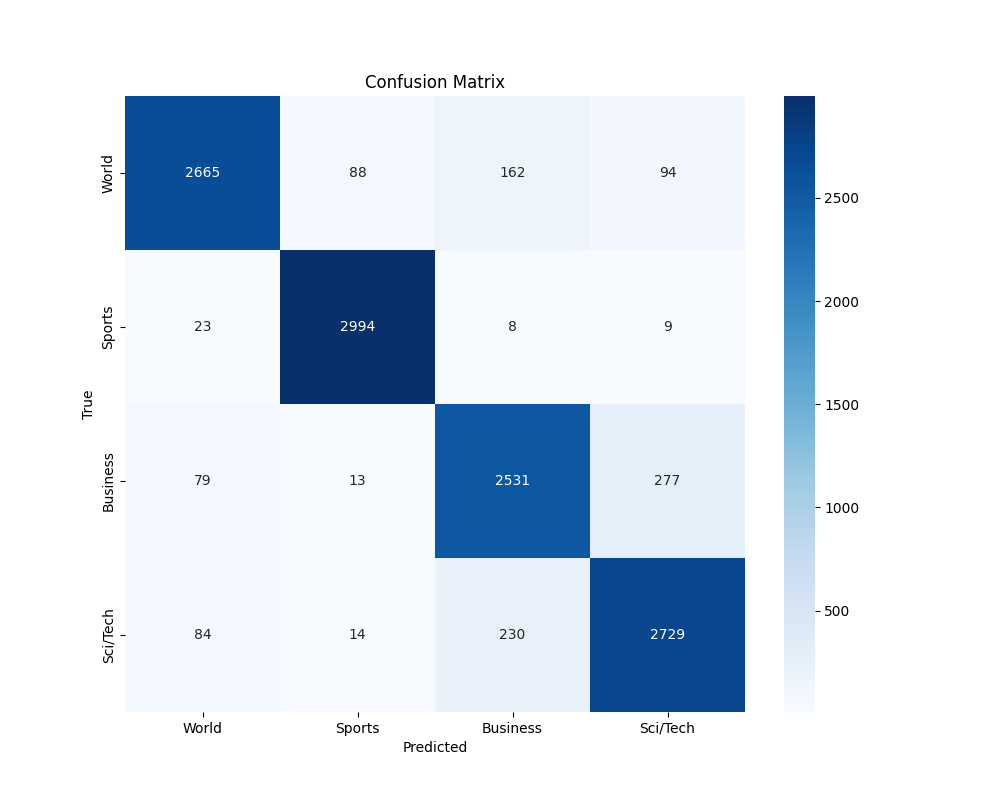

# LoRA AG News Classification

This repository contains our group project implementation of fine-tuning RoBERTa for AG News classification using Low-Rank Adaptation (LoRA).

## Project Overview

This project implements a text classification model for the AG News dataset using RoBERTa as the base model and LoRA for efficient fine-tuning. The model categorizes news articles into four classes: World, Sports, Business, and Sci/Tech, while training only 0.65% of the total model parameters.

## Key Features

  - Parameter Efficiency: Achieves 91.76% accuracy while fine-tuning only 814,852 parameters (0.65% of the model)
  - Strategic LoRA Application: Targets specific attention matrices in key transformer layers
  - Dynamic Dropout Regularization: Custom scheduler gradually reduces dropout from 0.15 to 0.05 throughout training
  - Comprehensive Performance Analysis: Detailed class-wise evaluation and confusion matrix visualization


## Setup and Installation

```bash
# Clone the repository
git clone https://github.com/yourusername/lora-agnews-classification.git
cd lora-agnews-classification

# Install dependencies
pip install -r requirements.txt
```

## Dataset

The AG News corpus consists of news articles from more than 2,000 news sources. Each article is classified into one of four categories:
1. World
2. Sports
3. Business
4. Sci/Tech

The dataset is loaded using the Hugging Face datasets library.

## Model Architecture

- Base model: RoBERTa-base (125M parameters)
- Fine-tuning method: Low-Rank Adaptation (LoRA)
- LoRA Configuration:
       - Rank (r) = 36
       - Alpha = 32
       - Initial Dropout = 0.15 (dynamically reduced to 0.05)
       - Target modules:
             - Layer 0: Both query and key matrices
             - Layer 5: Query matrix
             - Layer 10: Query matrix
       - 814,852 trainable parameters (0.65% of total)

## Custom Components

Our implementation includes several custom components:

- **DropoutScheduler:** A callback that gradually reduces dropout from 0.15 to 0.05 throughout training
- **MetricsTracker:** A callback that records and visualizes training and validation metrics


## Training

To train the model:

```bash
python src/train.py
```

Alternatively, you can run the notebook:

```bash
jupyter notebook notebooks/model_training.ipynb
```

## Training Hyperparameters:

- Batch Size: 16
- Learning Rate: 2e-5
- Optimizer: AdamW
- Weight Decay: 0.01
- Epochs: 4
- Warmup Ratio: 0.1
- Dynamic dropout: 0.15 → 0.05

## Confusion Matrix




## Training Metrics/Performance Metrics

Overall Performance:
  - Accuracy: 91.76%
  - Precision: 91.77%
  - Recall: 91.76%
  - F1 Score: 91.74%

Class-wise Performance:

| Class    | Accuracy | Correct/Total | Common Confusions |
|----------|----------|---------------|-------------------|
| World    | 89.53%   | 2694/3009     | Business          |
| Sports   | 98.98%   | 3003/3034     | (Few errors)      |
| Business | 88.10%   | 2555/2900     | Sci/Tech, World   |
| Sci/Tech | 90.25%   | 2759/3057     | Business          |


## Inference

To run inference on new data:

```bash
python src/inference.py --input [path_to_input_file] --output [path_to_output_file]
```

## Key Findings

- Strategic Targeting: Applying LoRA to specific layers (rather than all layers) yielded better results
- Class Performance: Sports articles were the easiest to classify (98.98% accuracy)
- Confusion Areas: Business and Sci/Tech categories showed the most confusion
- Dynamic Dropout: Our custom DropoutScheduler improved model convergence


## Contributors

- Krish Murjani km6520
- Pratam Saraf ps5218
- Krapa Karthik kk5754


